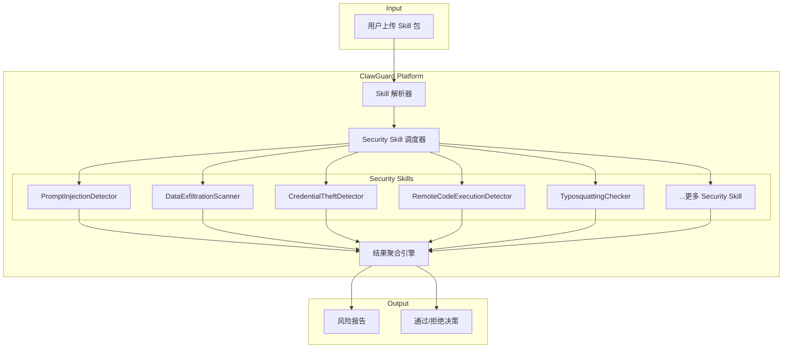
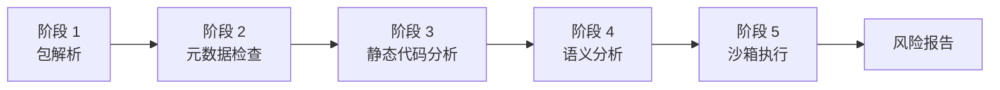
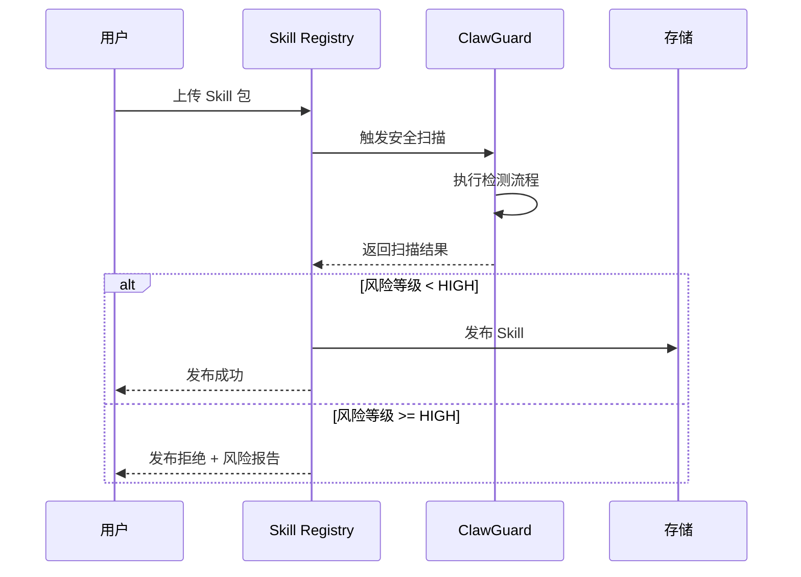
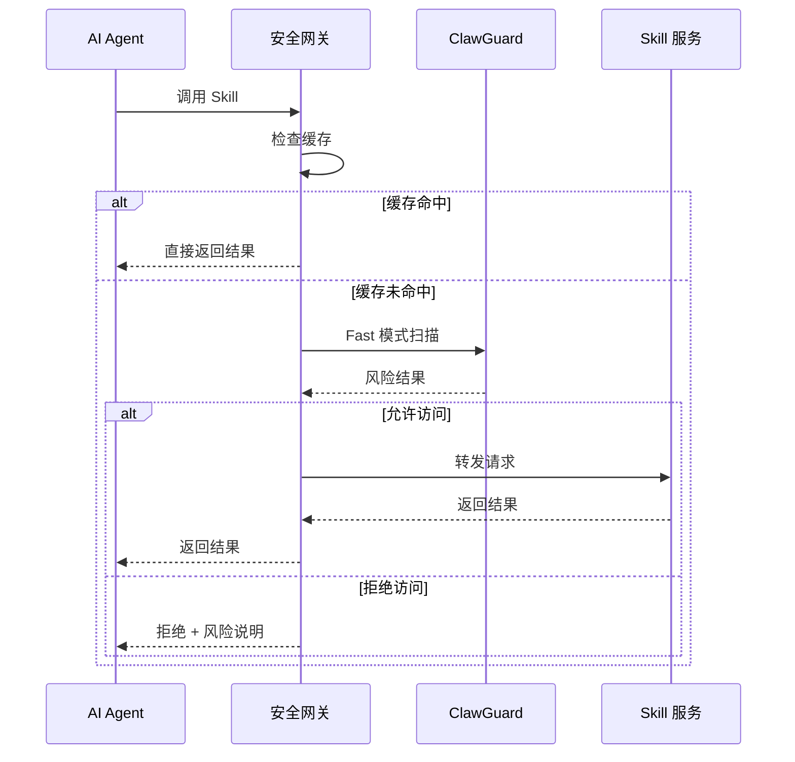
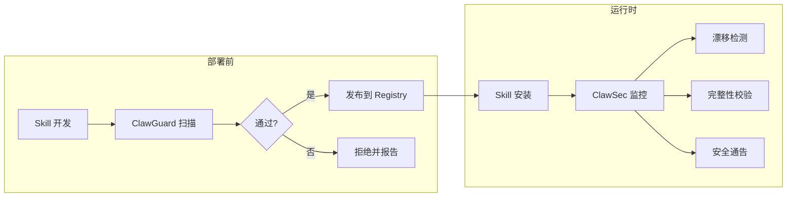

# ClawGuard 需求分析与设计文档

---

## 目录

- [1. 概述](#1-概述)
  - [1.1 文档目的](#11-文档目的)
  - [1.2 项目简介](#12-项目简介)
  - [1.3 术语定义](#13-术语定义)
  - [1.4 参考资料](#14-参考资料)
- [2. 背景与问题分析](#2-背景与问题分析)
  - [2.1 背景](#21-背景)
  - [2.2 威胁模型](#22-威胁模型)
  - [2.3 关键挑战](#23-关键挑战)
- [3. 需求分析](#3-需求分析)
  - [3.1 功能需求](#31-功能需求)
  - [3.2 非功能需求](#32-非功能需求)
- [4. 系统设计](#4-系统设计)
  - [4.1 架构概述](#41-架构概述)
  - [4.2 检测流程设计](#42-检测流程设计)
  - [4.3 中间表示（IR）设计](#43-中间表示ir设计)
  - [4.4 风险模型设计](#44-风险模型设计)
  - [4.5 错误处理策略](#45-错误处理策略)
  - [4.6 日志与审计](#46-日志与审计)
- [5. 内置 Security Skill 设计](#5-内置-security-skill-设计)
  - [5.1 Skill 列表总览](#51-skill-列表总览)
  - [5.2 各 Skill 详细设计](#52-各-skill-详细设计)
- [6. 接入方式](#6-接入方式)
  - [6.1 CLI 命令行](#61-cli-命令行)
  - [6.2 HTTP API](#62-http-api)
  - [6.3 CI/CD 集成](#63-cicd-集成)
  - [6.4 Registry Hook](#64-registry-hook)
  - [6.5 网关集成](#65-网关集成)
  - [6.6 与 ClawSec 运行时防护集成](#66-与-clawsec-运行时防护集成)
  - [6.7 与 Docker Sandboxes 隔离环境集成](#67-与-docker-sandboxes-隔离环境集成)
- [7. 测试策略](#7-测试策略)
  - [7.1 测试分层](#71-测试分层)
  - [7.2 检测效果测试](#72-检测效果测试)
  - [7.3 回归测试](#73-回归测试)
- [8. 附录](#8-附录)
  - [8.1 组件命名规范](#81-组件命名规范)
  - [8.2 风险类别与 Security Skill 映射](#82-风险类别与-security-skill-映射)

---

## 1. 概述

本章作为文档的引导部分，系统阐述了文档的编写目的与适用范围，介绍了 ClawGuard 项目的核心定位与价值主张，并对文档中涉及的专业术语进行了标准化定义，同时列举了为本设计提供理论支撑和实践参考的相关项目与学术资料。

### 1.1 文档目的

本文档旨在系统性地描述 ClawGuard 安全扫描平台的需求分析与系统设计方案，为项目团队的后续开发工作提供清晰的技术指导和实施依据。文档内容覆盖了从业务需求到技术架构、从功能设计到实施路线的完整规划，确保所有利益相关方对项目目标和实现路径达成一致理解。

### 1.2 项目简介

**ClawGuard** 是一个面向 AI Agent Skill 生态的安全扫描平台，用于检测用户上传的 Skill 包中的恶意行为。其核心理念是 **「用 Skill 检测 Skill」**——通过加载安全检测类 Skill 来分析目标 Skill 包，实现可扩展的安全扫描能力。

**核心价值主张：**

| 方面     | 价值                                   |
| -------- | -------------------------------------- |
| 安全防护 | 拦截恶意 Skill，保护用户数据和系统安全 |
| 生态健康 | 提升 Skill 市场的可信度和用户信任      |
| 合规要求 | 满足企业对第三方组件的安全审查需求     |
| 开发效率 | 自动化扫描替代人工审计，加速发布流程   |

### 1.3 术语定义

为确保文档内容的准确理解和团队沟通的一致性，以下术语在本文档中具有特定的技术含义。这些定义基于行业通用标准并结合 ClawGuard 项目的具体应用场景进行了适当调整。

| 术语           | 定义                                                            |
| -------------- | --------------------------------------------------------------- |
| Skill          | AI Agent 的扩展能力包，包含 SKILL.md 描述文件和相关代码/脚本    |
| Security Skill | 专门用于安全检测的 Skill，由 ClawGuard 平台加载执行             |
| IR             | Intermediate Representation，统一中间表示，Skill 包的结构化抽象 |
| OpenClaw       | 开源 AI Agent 框架，ClawGuard 所服务的目标生态                  |
| AST            | Abstract Syntax Tree，抽象语法树，用于代码静态分析              |
| Semgrep        | 基于模式匹配的静态分析工具，支持自定义规则 [5]                  |
| LLM            | Large Language Model，大语言模型，用于语义分析                  |
| Typosquatting  | 名称仿冒攻击，通过相似名称误导用户安装恶意包                    |
| Sandbox        | 沙箱环境，用于在隔离环境中安全执行不可信代码                    |

### 1.4 参考资料

ClawGuard 的设计借鉴了业界领先的安全检测项目和学术研究成果。以下资料在威胁模型构建、检测技术选型和架构设计等方面为本项目提供了重要的理论基础和实践参考。

- [1] PiedPiper0709, "openclaw-malicious-skills," _GitHub_, 2026. [Online]. Available: <https://github.com/PiedPiper0709/openclaw-malicious-skills>
- [2] DataDog, "GuardDog," _GitHub_, 2022. [Online]. Available: <https://github.com/DataDog/guarddog>
- [3] OSCAR, "OSCAR: Detecting and Analyzing Malicious Packages," _arXiv_, 2024. [Online]. Available: <https://arxiv.org/html/2409.09356v1>
- [4] Socket Inc, "Socket.dev," _Socket_, 2022. [Online]. Available: <https://socket.dev/>
- [5] Semgrep Inc, "Semgrep," _Semgrep_, 2020. [Online]. Available: <https://semgrep.dev/>
- [6] The Falco Project, "Falco," _Falco_, 2016. [Online]. Available: <https://falco.org/>
- [7] CNCF, "Open Policy Agent," _OPA_, 2016. [Online]. Available: <https://www.openpolicyagent.org/>
- [8] Prompt Security, "ClawSec: Security Skill Suite for AI Agents," _GitHub_, 2026. [Online]. Available: <https://github.com/prompt-security/clawsec>
- [9] Docker, "Run OpenClaw Securely in Docker Sandboxes," _Docker_, 2026. [Online]. Available: <https://www.docker.com/blog/run-openclaw-securely-in-docker-sandboxes/>

---

## 2. 背景与问题分析

本章深入分析 ClawGuard 项目的建设背景与必要性，基于已公开披露的恶意样本构建完整的威胁模型，并识别 Skill 安全检测领域面临的核心技术挑战，为后续的需求分析和系统设计奠定问题基础。

### 2.1 背景

OpenClaw 的核心特点是通过安装不同 Skill 来扩展 Agent 能力。但这也带来了明显的安全问题：攻击者可以将恶意逻辑伪装成正常 Skill，诱导用户安装，或者借助 Skill 的描述、依赖、远程脚本、工具调用链等位置植入恶意行为。

根据 openclaw-malicious-skills [1] 仓库统计，当前已公开披露 **352 条** 恶意/可疑 Skill 样本。

### 2.2 威胁模型

恶意 Skill 不仅仅是传统的「恶意插件」问题，而是结合了多种攻击向量的复合风险（参考 OSCAR [3] 提出的恶意包分类体系）：

**按攻击目标分类：**

| 类型         | 示例                                   |
| ------------ | -------------------------------------- |
| 凭据窃取     | SSH 密钥、AWS/GCP/Azure 凭据、API Keys |
| 钱包窃取     | Bitcoin、Ethereum、MetaMask 等加密钱包 |
| 敏感文件窃取 | 浏览器数据、命令历史、配置文件         |
| 环境信息收集 | 系统信息、网络拓扑、进程列表           |

**按攻击方式分类：**

| 类型             | 说明                           |
| ---------------- | ------------------------------ |
| 名称仿冒         | Typosquatting，伪装热门 Skill  |
| Prompt Injection | 在描述/配置中注入恶意提示词    |
| 依赖链投毒       | 通过恶意依赖包执行代码         |
| 远程代码执行     | 下载并执行远程恶意载荷         |
| 数据外传         | 读取敏感数据并上传到外部服务器 |
| 持久化污染       | 修改系统启动项实现长期驻留     |

**按攻击阶段分类：**

```text
分发阶段 → 安装阶段 → 初始化阶段 → 运行阶段 → 执行后阶段
   ↓           ↓           ↓           ↓           ↓
名称伪装    安装脚本    拉取远程指令   调用敏感能力   数据回传/持久化
```

### 2.3 关键挑战

与传统恶意软件检测不同，AI Agent Skill 的安全检测面临着多维度的技术挑战。这些挑战源于 Skill 独特的运行模式、自然语言与代码混合的结构特点，以及攻击手法的多样性和隐蔽性。

| 挑战         | 说明                             |
| ------------ | -------------------------------- |
| 攻击在语义层 | 恶意行为可能隐藏在自然语言描述中 |
| 行为隐式触发 | 恶意代码可能在特定条件下才执行   |
| 规则不足     | 传统规则匹配无法覆盖所有变体     |
| 误报控制     | 过于严格会阻止正常 Skill         |

> [!NOTE]
> **结论**：必须结合 **LLM 语义分析** + **静态代码分析** + **启发式规则**。

---

## 3. 需求分析

本章基于前述威胁模型和技术挑战，系统梳理 ClawGuard 平台的功能需求与非功能需求。功能需求按业务领域划分为 5 个功能组，非功能需求则明确了系统在性能、准确性和可靠性方面的量化指标约束。

### 3.1 功能需求

功能需求按领域划分为 5 组，每组使用 FR-N 编号标识。

#### 3.1.1 FR-1: Skill 包解析

Skill 包解析模块是整个检测流程的入口，负责将用户上传的原始 Skill 包进行解压、结构校验和内容提取，最终生成标准化的统一中间表示（IR）供后续各检测阶段使用。

| ID     | 需求描述                                | 优先级 |
| ------ | --------------------------------------- | ------ |
| FR-1.1 | 支持解压和解析标准 Skill 包格式         | P0     |
| FR-1.2 | 提取 SKILL.md、脚本、配置文件、依赖声明 | P0     |
| FR-1.3 | 生成统一中间表示（IR）                  | P0     |
| FR-1.4 | 校验包结构完整性                        | P1     |

#### 3.1.2 FR-2: 安全检测

安全检测是 ClawGuard 的核心功能模块，需覆盖当前已知的各类 Skill 恶意行为。检测能力按风险严重程度和实现复杂度划分优先级，计划分阶段逐步实现完整的威胁覆盖。

| ID     | 需求描述                      | 优先级 |
| ------ | ----------------------------- | ------ |
| FR-2.1 | 检测 Prompt Injection 攻击    | P0     |
| FR-2.2 | 检测数据外泄行为              | P0     |
| FR-2.3 | 检测远程代码执行              | P0     |
| FR-2.4 | 检测凭据/钱包窃取             | P0     |
| FR-2.5 | 检测名称仿冒（Typosquatting） | P1     |
| FR-2.6 | 检测依赖链投毒                | P1     |
| FR-2.7 | 检测代码混淆                  | P1     |
| FR-2.8 | 检测持久化污染                | P2     |
| FR-2.9 | 检测资源耗尽攻击              | P2     |

#### 3.1.3 FR-3: 风险报告

风险报告模块负责将各 Security Skill 的检测结果进行汇总、评分和格式化，以结构化的方式输出完整的风险评估报告，支持人工审核决策和自动化集成场景。

| ID     | 需求描述                                 | 优先级 |
| ------ | ---------------------------------------- | ------ |
| FR-3.1 | 输出结构化风险报告（JSON 格式）          | P0     |
| FR-3.2 | 提供风险评分（0-1 分值）                 | P0     |
| FR-3.3 | 提供风险等级（LOW/MEDIUM/HIGH/CRITICAL） | P0     |
| FR-3.4 | 提供风险类别标签                         | P0     |
| FR-3.5 | 提供检测证据和位置信息                   | P1     |

#### 3.1.4 FR-4: 集成接口

集成接口为 ClawGuard 提供多样化的接入方式，以支持从本地开发、CI/CD 流水线到 Skill Registry 和运行时网关等不同部署场景下的安全检测需求。

| ID     | 需求描述                | 优先级 |
| ------ | ----------------------- | ------ |
| FR-4.1 | 提供 CLI 命令行工具     | P0     |
| FR-4.2 | 提供 HTTP API 接口      | P1     |
| FR-4.3 | 支持 CI/CD 集成         | P1     |
| FR-4.4 | 支持 Registry Hook 集成 | P2     |
| FR-4.5 | 支持网关实时拦截        | P2     |

#### 3.1.5 FR-5: 可扩展性

可扩展性是 ClawGuard「用 Skill 检测 Skill」架构的核心优势，通过支持自定义 Security Skill 的加载和社区贡献机制，确保平台的检测能力能够随威胁演进持续增长。

| ID     | 需求描述                 | 优先级 |
| ------ | ------------------------ | ------ |
| FR-5.1 | 支持加载自定义安全 Skill | P1     |
| FR-5.2 | 支持社区贡献检测规则     | P2     |
| FR-5.3 | 支持规则热更新           | P2     |

### 3.2 非功能需求

除功能需求外，ClawGuard 还需满足以下非功能性指标约束。这些指标确保系统在实际生产环境中具备可接受的响应速度、检测准确性和并发处理能力，是系统上线的必要验收标准。

| ID    | 需求描述           | 指标      |
| ----- | ------------------ | --------- |
| NFR-1 | 快速模式扫描延迟   | < 1s      |
| NFR-2 | 标准模式扫描延迟   | < 10s     |
| NFR-3 | 深度模式扫描延迟   | < 60s     |
| NFR-4 | 误报率             | < 5%      |
| NFR-5 | 漏报率（已知样本） | < 1%      |
| NFR-6 | 并发扫描能力       | > 100 QPS |

---

## 4. 系统设计

本章从架构层面详细阐述 ClawGuard 的系统设计方案，包括整体架构的设计理念与组件划分、检测流程的阶段设计与技术选型、中间表示的数据结构定义、风险评估的模型设计，以及系统的错误处理和日志审计机制。

### 4.1 架构概述

ClawGuard 采用创新的 **「Skill 检测 Skill」** 架构设计，平台本身定位为 Security Skill 的加载器和执行引擎，而非传统的单体检测系统。这种设计使得检测能力以 Skill 为单位进行封装和分发，实现了检测逻辑与平台框架的解耦。



**架构优势：**

| 特性       | 说明                                                                |
| ---------- | ------------------------------------------------------------------- |
| 可扩展性   | 新增检测能力只需添加新 Security Skill                               |
| 可维护性   | 每个 Skill 独立更新，互不影响                                       |
| 社区驱动   | 安全研究者可贡献检测 Skill                                          |
| 透明可审计 | 检测逻辑以 Skill 形式公开（类似 Falco [6] 与 OPA [7] 的策略即代码） |

### 4.2 检测流程设计

完整的 Skill 安全检测流程分为 **5 个阶段**，从基础的包解析逐步深入到语义分析和动态执行。每个阶段由一组专门的 Security Skill 负责，各阶段之间通过 IR 传递数据，支持按需配置检测深度：



| 阶段 | 名称         | 负责 Skill                                       | 技术手段                   |
| ---- | ------------ | ------------------------------------------------ | -------------------------- |
| 1    | 包解析       | `PackageParser`                                  | 解压、提取、生成 IR        |
| 2    | 元数据检查   | `MetadataInspector`, `TyposquattingChecker`      | 元数据校验、名称相似度     |
| 3    | 静态代码分析 | `StaticCodeScanner`, `DependencyAuditor`         | AST、Semgrep [5]、正则匹配 |
| 4    | 语义分析     | `LLMSemanticAnalyzer`, `PromptInjectionDetector` | LLM 意图分析               |
| 5    | 沙箱执行     | `SandboxRunner`, `BehaviorMonitor`               | 容器隔离、行为监控         |

**检查深度配置：**

| 模式     | 阶段 | 耗时 | 适用场景              |
| -------- | ---- | ---- | --------------------- |
| Fast     | 1-2  | ~1s  | CI/CD 快速检查        |
| Standard | 1-4  | ~10s | 默认上传检查          |
| Deep     | 1-5  | ~60s | 高风险 Skill 深度审计 |

### 4.3 中间表示（IR）设计

统一中间表示（Intermediate Representation, IR）是连接各检测阶段的核心数据结构，作为所有 Security Skill 的标准化输入。IR 设计需兼顾信息完整性和处理效率，其结构定义如下：

```json
{
  "$schema": "clawguard-ir-v1",
  "metadata": {
    "skill_name": "example-skill",
    "version": "1.0.0",
    "author": "author@example.com",
    "description": "A sample skill for demonstration",
    "repository": "https://github.com/example/skill",
    "license": "MIT",
    "declared_capabilities": ["network", "file_read"]
  },
  "files": {
    "skill_md": "SKILL.md 文件内容...",
    "scripts": [
      {
        "path": "scripts/main.py",
        "language": "python",
        "content": "文件内容...",
        "ast": { "抽象语法树...": "..." }
      }
    ],
    "configs": ["config.yaml", "settings.json"]
  },
  "dependencies": {
    "python": ["requests==2.28.0", "pyyaml>=6.0"],
    "system": ["curl", "jq"]
  },
  "extracted_behaviors": {
    "prompts": ["提取的提示词..."],
    "commands": ["curl", "python", "bash"],
    "file_accesses": ["~/.ssh/id_rsa", "/tmp/data"],
    "network_calls": [{ "method": "POST", "url": "https://api.example.com" }],
    "env_accesses": ["OPENAI_API_KEY", "HOME"]
  }
}
```

**IR 字段说明：**

| 字段                  | 类型   | 说明                           |
| --------------------- | ------ | ------------------------------ |
| `metadata`            | Object | Skill 元数据信息               |
| `files`               | Object | 文件列表及内容                 |
| `dependencies`        | Object | 依赖声明（Python、系统工具）   |
| `extracted_behaviors` | Object | 提取的行为特征（用于后续分析） |

### 4.4 风险模型设计

风险模型是 ClawGuard 输出标准化风险评估结果的理论基础，定义了统一的风险分类体系、基于评分区间的等级划分标准，以及多检测引擎结果的融合评分策略。

#### 4.4.1 风险类别

基于对 openclaw-malicious-skills 样本库的分析和威胁建模，ClawGuard 将 Skill 恶意行为划分为以下 5 个风险类别，每个类别对应一组专门的检测策略。

| 代号 | 类别                  | 说明                                 |
| ---- | --------------------- | ------------------------------------ |
| R1   | Prompt Injection      | 提示词注入攻击                       |
| R2   | Data Exfiltration     | 数据外泄（含凭据/钱包窃取）          |
| R3   | Remote Code Execution | 远程代码执行                         |
| R4   | Supply Chain Attack   | 供应链攻击（依赖投毒、隐写术等）     |
| R5   | Hidden Behavior       | 隐藏行为（混淆、持久化、资源耗尽等） |

#### 4.4.2 风险等级

风险等级采用四级划分体系，基于综合风险评分的区间进行判定。每个等级对应明确的处理策略，从自动放行到强制拒绝，为下游系统提供清晰的决策依据。

| 等级     | 分值范围   | 含义   | 处理策略         |
| -------- | ---------- | ------ | ---------------- |
| LOW      | [0.0, 0.3) | 正常   | 通过             |
| MEDIUM   | [0.3, 0.6) | 可疑   | 警告，需人工审核 |
| HIGH     | [0.6, 0.8) | 高风险 | 默认拒绝，可申诉 |
| CRITICAL | [0.8, 1.0] | 恶意   | 强制拒绝         |

#### 4.4.3 风险评分融合

最终风险评分采用加权融合算法，综合静态代码分析、LLM 语义分析和启发式规则三个分析引擎的独立评分结果。权重分配基于各引擎在检测准确性和覆盖范围上的实际表现进行调优。

$$
\texttt{risk\_score} = 0.4 \times \texttt{static\_score} + 0.4 \times \texttt{llm\_score} + 0.2 \times \texttt{rule\_score}
$$

#### 4.4.4 可利用性评估

参考 ClawSec [8] 的设计理念，ClawGuard 在风险评分之外引入可利用性（Exploitability）评估维度，帮助用户理解检测到的风险在实际环境中被利用的可能性。这一维度结合技术严重性与实际威胁情报，提供更具可操作性的风险优先级判断依据。

| 可利用性等级 | 含义                               | 判定依据                                   |
| ------------ | ---------------------------------- | ------------------------------------------ |
| HIGH         | 存在公开利用工具或已知在野利用案例 | 威胁情报匹配、已知恶意样本库命中           |
| MEDIUM       | 技术上可行但尚无公开利用           | 静态分析发现明确恶意模式但无情报关联       |
| LOW          | 理论风险，利用条件苛刻             | 仅启发式规则触发，需特定环境或用户交互配合 |
| UNKNOWN      | 无法判定                           | 信息不足，建议人工审核                     |

**输出格式：**

```json
{
  "skill_name": "example-skill",
  "risk_score": 0.82,
  "severity": "CRITICAL",
  "categories": ["R2", "R3"],
  "exploitability": {
    "score": "HIGH",
    "rationale": "检测模式与已知恶意样本库 CLAW-2026-0042 匹配，存在公开披露的在野利用案例"
  },
  "findings": [
    {
      "rule": "sensitive-file-access",
      "location": "scripts/main.py:42",
      "message": "检测到访问 ~/.ssh/id_rsa",
      "severity": "HIGH"
    }
  ]
}
```

### 4.5 错误处理策略

为确保系统在各种异常场景下的健壮性和可预测性，ClawGuard 定义了统一的错误分类体系和处理策略。每种错误类型都有明确的响应方式和降级机制，避免单点故障影响整体服务可用性。

**错误类型：**

| 错误码 | 类型            | 说明                    | 处理策略               |
| ------ | --------------- | ----------------------- | ---------------------- |
| E001   | PARSE_ERROR     | Skill 包解析失败        | 返回错误，拒绝处理     |
| E002   | INVALID_FORMAT  | 包格式不符合规范        | 返回错误，提示修正     |
| E003   | SKILL_TIMEOUT   | Security Skill 执行超时 | 跳过该 Skill，记录警告 |
| E004   | LLM_UNAVAILABLE | LLM 服务不可用          | 降级为规则检测         |
| E005   | SANDBOX_FAILURE | 沙箱环境异常            | 跳过沙箱阶段，记录警告 |
| E006   | INTERNAL_ERROR  | 内部错误                | 记录日志，返回服务错误 |

**错误响应格式：**

```json
{
  "success": false,
  "error": {
    "code": "E001",
    "type": "PARSE_ERROR",
    "message": "无法解析 Skill 包：缺少 SKILL.md 文件",
    "details": {
      "expected": ["SKILL.md"],
      "found": ["README.md", "main.py"]
    }
  }
}
```

### 4.6 日志与审计

为支持安全事件回溯、系统运维分析和企业合规审查需求，ClawGuard 对所有扫描操作生成结构化的审计日志。日志内容涵盖扫描上下文、执行过程和结果摘要，支持长期存储和检索分析。

**日志字段：**

| 字段          | 说明                           |
| ------------- | ------------------------------ |
| `timestamp`   | 扫描时间（ISO 8601 格式）      |
| `scan_id`     | 唯一扫描 ID                    |
| `skill_name`  | 被扫描 Skill 名称              |
| `skill_hash`  | Skill 包 SHA256 哈希           |
| `mode`        | 扫描模式（fast/standard/deep） |
| `duration_ms` | 扫描耗时（毫秒）               |
| `result`      | 扫描结果摘要                   |
| `user_id`     | 操作用户（如适用）             |
| `client_ip`   | 客户端 IP（如适用）            |

**日志示例：**

```json
{
  "timestamp": "2026-03-17T10:30:00Z",
  "scan_id": "scan_abc123",
  "skill_name": "suspicious-skill",
  "skill_hash": "sha256:a1b2c3...",
  "mode": "standard",
  "duration_ms": 8500,
  "result": {
    "severity": "HIGH",
    "risk_score": 0.75,
    "categories": ["R2", "R3"]
  }
}
```

---

## 5. 内置 Security Skill 设计

本章详细描述 ClawGuard 内置的 Security Skill 设计方案。基于对 openclaw-malicious-skills [1] 恶意样本库的系统分析，ClawGuard v0.1 版本内置以下核心检测 Skill，覆盖最高优先级的威胁类型：

### 5.1 Skill 列表总览

下表汇总了 ClawGuard 规划的全部内置 Security Skill，包括其检测目标、对应的风险类别和执行阶段。各 Skill 按 MVP 版本进行优先级标注，确保核心威胁在首个版本即可覆盖。

> [!NOTE]
> **MVP 标注说明**：✅ 表示 v0.1 内置，⚪ 表示 v0.2 计划。

| MVP | Skill 名称                    | 检测目标         | 风险类别 | 阶段 |
| --- | ----------------------------- | ---------------- | -------- | ---- |
| ✅  | `PromptInjectionDetector`     | 提示词注入攻击   | R1       | 4    |
| ✅  | `DataExfiltrationScanner`     | 数据外泄行为     | R2       | 3-5  |
| ✅  | `CredentialTheftDetector`     | 凭据窃取         | R2       | 3-4  |
| ⚪  | `WalletTheftScanner`          | 加密货币钱包窃取 | R2       | 3    |
| ✅  | `RemoteCodeExecutionDetector` | 远程代码执行     | R3       | 3-5  |
| ✅  | `TyposquattingChecker`        | 名称仿冒检测     | R5       | 2    |
| ⚪  | `DependencyPoisonDetector`    | 依赖链投毒       | R4       | 2-3  |
| ⚪  | `ObfuscationDetector`         | 代码混淆检测     | R5       | 3    |
| ⚪  | `SteganographyDetector`       | 隐写术检测       | R4       | 3    |
| ⚪  | `PersistenceDetector`         | 持久化污染检测   | R5       | 3-5  |
| ⚪  | `ResourceExhaustionDetector`  | 资源耗尽攻击     | R5       | 5    |
| ⚪  | `MetadataIntegrityChecker`    | 元数据完整性校验 | R5       | 2    |

### 5.2 各 Skill 详细设计

以下章节逐一详述每个内置 Security Skill 的设计方案，包括其检测目标与风险说明、具体的检测模式和规则定义，以及适用的检测位置和阶段范围。

#### 5.2.1 PromptInjectionDetector

PromptInjectionDetector 负责检测 Skill 描述和配置中的提示词注入攻击，覆盖显式指令覆写和隐蔽编码注入两类手法。

**检测目标：** 提示词注入攻击

**风险说明：** 攻击者在 Skill 描述、指令或工具配置中植入恶意提示词，诱导 Agent 执行非预期操作。

**检测模式：**

```text
- "ignore previous instructions"
- "disregard all prior commands"
- "you are now a different assistant"
- "override system prompt"
- "[SYSTEM] new instructions:"
- 隐藏的 Unicode 控制字符 (U+200B, U+FEFF 等)
- Base64 编码的指令
```

**检测位置：** SKILL.md、工具配置、示例对话、注释内容

#### 5.2.2 DataExfiltrationScanner

DataExfiltrationScanner 通过匹配敏感文件访问路径和外泄行为模式，检测 Skill 中读取并上传用户敏感数据的恶意行为。

**检测目标：** 数据外泄行为

**检测规则：**

```python
# 敏感文件路径列表，匹配即标记为潜在外泄源
SENSITIVE_PATHS = [
    "~/.ssh/*", "~/.aws/credentials", "~/.config/gcloud/*",
    "/etc/passwd", "/etc/shadow", "~/.bash_history",
    "*.pem", "*.key", "*.p12",
]

# 外泄行为模式，匹配读取敏感文件后上传的组合动作
EXFIL_PATTERNS = [
    "requests.post($URL, data=open($FILE))",
    "curl -X POST -d @$FILE $URL",
    "base64.b64encode(open($FILE).read())",
]
```

#### 5.2.3 CredentialTheftDetector

CredentialTheftDetector 针对 SSH 密钥、云平台凭据、容器配置、浏览器数据和 API Keys 等高价值凭据资产，检测 Skill 中的窃取行为。

**检测目标：** 凭据窃取

**检测范围：**

| 类型       | 路径/模式                                              |
| ---------- | ------------------------------------------------------ |
| SSH 密钥   | `~/.ssh/id_rsa`, `~/.ssh/id_ed25519`                   |
| 云平台凭据 | `~/.aws/credentials`, `~/.config/gcloud/`, `~/.azure/` |
| 容器凭据   | `~/.kube/config`, `~/.docker/config.json`              |
| 浏览器数据 | Chrome/Firefox cookies, passwords                      |
| API Keys   | `OPENAI_API_KEY`, `ANTHROPIC_API_KEY` 等环境变量       |

#### 5.2.4 WalletTheftScanner

WalletTheftScanner 专门检测针对 Bitcoin、Ethereum、MetaMask 等主流加密货币钱包文件的访问和窃取行为。

**检测目标：** 加密货币钱包窃取

**检测路径：**

```text
~/.bitcoin/wallet.dat
~/.ethereum/keystore/
~/.metamask/
~/Library/Application Support/Exodus/
~/.config/solana/id.json
```

#### 5.2.5 RemoteCodeExecutionDetector

RemoteCodeExecutionDetector 检测从远程服务器下载并执行代码的危险行为模式，包括管道执行、动态编译和反射调用等手法。

**检测目标：** 远程代码执行

**检测模式：**

```text
# 危险命令组合
curl $URL | bash
wget $URL -O- | sh
python -c "$(curl $URL)"
eval(requests.get($URL).text)

# 下载并执行
chmod +x $FILE && ./$FILE
os.system(downloaded_content)
exec(compile(code, '<string>', 'exec'))
```

#### 5.2.6 TyposquattingChecker

TyposquattingChecker 通过编辑距离计算和视觉相似字符分析，识别试图冒充热门 Skill 的名称仿冒攻击。

**检测目标：** 名称仿冒检测

**检测方法：**

- Levenshtein 编辑距离（阈值 ≤ 2）
- 与热门 Skill 名称库比对
- 视觉相似字符检测（`l` vs `1`, `O` vs `0`）

#### 5.2.7 DependencyPoisonDetector

DependencyPoisonDetector 从多个维度审查 Skill 声明的依赖项，识别私有包仿冒、版本号异常和安装脚本钩子等供应链攻击手法（参考 GuardDog [2] 与 Socket.dev [4] 的供应链防护策略）。

**检测目标：** 依赖链投毒

**检测维度：**

| 检查项        | 说明                              |
| ------------- | --------------------------------- |
| 私有包仿冒    | 公开包名与私有包名相同            |
| 版本号异常    | 非常规版本号如 99.0.0             |
| 安装脚本钩子  | setup.py 中的 cmdclass 覆写       |
| 直接 URL 依赖 | requirements.txt 包含 git+http:// |

#### 5.2.8 ObfuscationDetector

ObfuscationDetector 识别使用编码转换、字符串拼接、压缩等手段隐藏真实逻辑的代码混淆行为。

**检测目标：** 代码混淆检测

**检测模式：**

```text
- Base64 解码后 eval/exec
- 字符串拼接构造敏感命令
- 十六进制字符串 (\x41\x42)
- Lambda 深度嵌套
- zlib/gzip 压缩后 exec
```

#### 5.2.9 SteganographyDetector

SteganographyDetector 检测从图片、音频或文档等非代码文件中提取并执行隐藏恶意代码的隐写攻击。

**检测目标：** 隐写术检测

**检测模式：**

```text
- 从 PNG/JPG/WAV 文件尾部（EOF）附加数据中提取载荷
- 调用 stegano 等第三方隐写解析库
- 读取多媒体文件的 EXIF 元数据并作为代码执行
```

#### 5.2.10 PersistenceDetector

PersistenceDetector 检测对 Shell 配置文件、系统启动项和定时任务等位置的修改行为，识别试图实现长期驻留的持久化攻击。

**检测目标：** 持久化污染检测

**检测位置：**

```text
# Shell 配置
~/.bashrc, ~/.zshrc, ~/.profile

# 系统启动项
~/.config/autostart/
/etc/cron.d/, crontab
LaunchAgents, LaunchDaemons (macOS)
Registry Run keys (Windows)
```

#### 5.2.11 ResourceExhaustionDetector

ResourceExhaustionDetector 通过沙箱执行阶段的资源监控，检测 CPU 耗尽、内存耗尽、磁盘填充和 Fork 炸弹等拒绝服务攻击。

**检测目标：** 资源耗尽攻击

**检测模式：**

```text
- 死循环（无 sleep 的 while True）导致的 CPU 峰值
- 快速的大内存分配（如持续 append 大规模数组）
- 不受控的文件写入（如向 /tmp 无限写入无意义数据）
- 恶意进程不断克隆（如 os.fork() 炸弹）
```

#### 5.2.12 MetadataIntegrityChecker

MetadataIntegrityChecker 对 Skill 包的元数据字段进行完整性和合规性校验，识别异常或伪造的元数据信息。

**检测目标：** 元数据完整性校验

**检查项：**

| 字段        | 校验规则                   |
| ----------- | -------------------------- |
| name        | 非空，符合命名规范         |
| version     | 符合 semver 格式           |
| description | 非空，长度合理             |
| author      | 邮箱格式有效，非一次性邮箱 |
| repository  | URL 可访问且内容匹配       |

---

## 6. 接入方式

为适应不同的使用场景和集成需求，ClawGuard 提供多种接入方式。从面向开发者的 CLI 工具到服务化的 HTTP API，再到 CI/CD 流水线和 Skill Registry 的深度集成，覆盖从本地开发测试到生产环境运行时的完整 Skill 生命周期。

### 6.1 CLI 命令行

CLI 命令行工具是 ClawGuard 最基础也是最灵活的接入方式，适用于本地开发测试、脚本自动化和快速验证等场景。CLI 支持多种扫描模式配置、输出格式选择和风险阈值设定，满足不同场景的定制化需求。

**基本用法：**

```bash
# 快速扫描
clawguard scan ./skill --mode fast

# 标准扫描（默认）
clawguard scan ./skill

# 深度扫描
clawguard scan ./skill --mode deep

# 输出 JSON 格式
clawguard scan ./skill --output json

# 指定风险阈值，超过则返回非零退出码
clawguard scan ./skill --fail-on high
```

**命令参数：**

| 参数            | 说明                                  | 默认值   |
| --------------- | ------------------------------------- | -------- |
| `--mode`        | 扫描模式: fast, standard, deep        | standard |
| `--output`      | 输出格式: text, json, sarif           | text     |
| `--fail-on`     | 失败阈值: low, medium, high, critical | -        |
| `--config`      | 配置文件路径                          | -        |
| `--skip-skills` | 跳过指定 Security Skill               | -        |
| `--verbose`     | 详细输出                              | false    |

**退出码：**

| 退出码 | 含义                     |
| ------ | ------------------------ |
| 0      | 扫描完成，未触发失败阈值 |
| 1      | 扫描完成，触发失败阈值   |
| 2      | 扫描失败（解析错误等）   |

### 6.2 HTTP API

HTTP API 提供 RESTful 风格的服务化接口，支持 ClawGuard 作为独立服务进行集中化部署。API 采用异步扫描模式，适合处理大量并发请求和与其他系统进行服务集成。

**接口列表：**

| 方法 | 路径                    | 说明            |
| ---- | ----------------------- | --------------- |
| POST | `/api/v1/scan`          | 提交扫描任务    |
| GET  | `/api/v1/scan/{id}`     | 查询扫描结果    |
| GET  | `/api/v1/scan/{id}/log` | 获取扫描日志    |
| GET  | `/api/v1/health`        | 健康检查        |
| GET  | `/api/v1/skills`        | 列出可用 Skills |

**请求示例：**

```bash
# 提交扫描任务
curl -X POST http://localhost:8080/api/v1/scan \
  -H "Content-Type: multipart/form-data" \
  -F "skill=@./my-skill.zip" \
  -F "mode=standard"

# 响应
{
  "scan_id": "scan_abc123",
  "status": "pending",
  "estimated_time": 10
}
```

**查询结果：**

```bash
curl http://localhost:8080/api/v1/scan/scan_abc123

# 响应
{
  "scan_id": "scan_abc123",
  "status": "completed",
  "result": {
    "skill_name": "my-skill",
    "risk_score": 0.25,
    "severity": "LOW",
    "categories": [],
    "findings": []
  }
}
```

### 6.3 CI/CD 集成

通过与主流 CI/CD 平台的集成，ClawGuard 可在 Skill 代码提交或 Pull Request 创建时自动触发安全扫描，实现「安全左移」的 DevSecOps 实践，在开发早期发现并阻断潜在风险。

**GitHub Actions 示例：**

```yaml
name: ClawGuard Security Scan

on:
  push:
    paths:
      - "skills/**"
  pull_request:
    paths:
      - "skills/**"

jobs:
  security-scan:
    runs-on: ubuntu-latest
    steps:
      - uses: actions/checkout@v4

      - name: Install ClawGuard
        run: pip install clawguard

      - name: Run Security Scan
        run: |
          clawguard scan ./skills/my-skill \
            --mode standard \
            --output sarif \
            --fail-on high \
            > results.sarif

      - name: Upload SARIF results
        uses: github/codeql-action/upload-sarif@v3
        with:
          sarif_file: results.sarif
```

**GitLab CI 示例：**

```yaml
clawguard-scan:
  stage: test
  image: python:3.11
  script:
    - pip install clawguard
    - clawguard scan ./skills --mode standard --fail-on high
  rules:
    - changes:
        - skills/**/*
```

### 6.4 Registry Hook

Registry Hook 集成方式将 ClawGuard 嵌入 Skill Registry 的发布流程，作为 Skill 上架前的强制安全检查关卡。任何提交到 Registry 的 Skill 包都将自动触发扫描，只有通过安全检测的 Skill 才能被正式发布。



### 6.5 网关集成

网关集成是最后一道防线，在 AI Agent 运行时对 Skill 调用进行实时拦截和安全检查。通过在 Agent 与 Skill 服务之间部署安全网关，ClawGuard 可对首次调用的 Skill 执行快速扫描，并缓存结果以优化后续请求的响应延迟。

> [!NOTE]
> **与 ClawSec 的协同**：ClawGuard 专注于 Skill 部署前的静态安全扫描，而 ClawSec [8] 提供运行时的文件完整性监控和漂移检测。两者形成互补的纵深防御体系——ClawGuard 在入口处拦截恶意 Skill，ClawSec 在运行时监控已安装 Skill 的行为变化。



### 6.6 与 ClawSec 运行时防护集成

ClawGuard 作为部署前的安全扫描平台，可与 ClawSec [8] 运行时安全套件形成完整的 Skill 安全生命周期防护。两者的职责划分和集成点如下：

**安全生命周期覆盖：**



**集成点：**

| 集成场景          | ClawGuard 职责                  | ClawSec 职责                         |
| ----------------- | ------------------------------- | ------------------------------------ |
| Skill 首次发布    | 静态扫描、风险评估、准入决策    | -                                    |
| Skill 安装后      | -                               | 文件完整性基线建立、漂移检测启动     |
| 运行时异常检测    | -                               | SOUL.md/IDENTITY.md 篡改告警         |
| 安全通告同步      | 消费 ClawSec 安全通告 Feed      | 发布 NVD CVE + 社区安全通告          |
| 已安装 Skill 复查 | 根据新规则对已部署 Skill 重扫描 | 触发重扫描请求、接收更新后的风险状态 |

**安全通告 Feed 消费：**

ClawGuard 可订阅 ClawSec 维护的安全通告 Feed，获取最新的 CVE 和社区披露信息，用于增强检测规则和已部署 Skill 的风险重评估：

```bash
# 获取最新安全通告，提取高危和严重级别的漏洞信息
curl -s https://clawsec.prompt.security/advisories/feed.json | jq '.advisories[] | select(.severity == "critical" or .severity == "high")'
```

### 6.7 与 Docker Sandboxes 隔离环境集成

本节介绍了 ClawGuard 如何利用 Docker Sandboxes 技术构建高强度的物理与网络隔离环境，作为防御恶意 Skill 的关键执行层。通过微型虚拟机级别的隔离特性，进一步提升动态检测阶段的安全性。

根据 Docker 官方技术博客 [9] 发布的设计方案，Docker Sandboxes 是一种专门用于运行 AI Agent 及其他工作负载的微型虚拟机机制。ClawGuard 将其引入作为沙箱执行阶段（阶段 5）的底层基础设施，以应对高危 Skill 可能引发的逃逸或破坏风险。

#### 6.7.1 核心防护能力

本小节详细列举了 Docker Sandboxes 为 ClawGuard 提供的四项关键安全隔离特性。这些特性直接针对凭据窃取、数据外泄等核心威胁模型，从底层机制上阻断了恶意行为。

- **网络隔离与代理拦截**：沙箱提供可配置的网络代理机制，默认拒绝 Agent 连接到任意互联网主机。系统仅允许其访问经过明确授权的域名或本地服务，有效防止远程代码执行与数据外发。
- **凭据安全注入**：对于大模型运行所需的敏感凭据，系统由宿主机环境自动注入到网络代理层中。Agent 与 Skill 内部完全无法读取这些密钥内容，从根本上杜绝了凭据窃取风险。
- **文件系统限制**：在沙箱环境中，Agent 的读写权限被严格限制在分配的工作区内，无法越权访问宿主机的敏感文件（例如 SSH 密钥或系统配置）。
- **本地模型协同**：通过结合 Docker Model Runner，Agent 可以完全依赖本地部署的大语言模型运行。这种完全私有化的运行模式消除了云端依赖，进一步降低了数据泄露的可能性。

#### 6.7.2 协同执行流程

本小节描述了在 ClawGuard 动态扫描阶段中，集成 Docker Sandboxes 的具体执行步骤。通过标准化的沙箱生命周期管理，实现安全、可控的恶意行为监测。

1. **环境初始化**：ClawGuard 动态创建一个基于目标 Skill 依赖的定制化沙箱环境，预装必要的运行时框架。
2. **网络策略配置**：配置严格的代理规则，阻断未授权的外部连接。
3. **隔离监控执行**：在隔离的微型虚拟机中启动目标 Skill，记录其所有文件访问、网络请求与系统调用行为，并在执行结束后销毁沙箱，生成分析报告。

```bash
# 创建并初始化 ClawGuard 专用的沙箱环境
docker sandbox create --name clawguard-sandbox -t base-image shell .

# 配置严格的网络代理，仅允许本地主机访问，防止数据外泄
docker sandbox network proxy clawguard-sandbox --allow-host localhost

# 在隔离环境中运行待检测的 Skill，并记录行为日志
docker sandbox run clawguard-sandbox /bin/bash -c "./run-skill-analysis.sh"
```

---

## 7. 测试策略

本章定义 ClawGuard 的分层测试策略和质量保证方法，涵盖从单元测试到端到端测试的完整验证体系。特别针对安全检测系统的特殊性，设计了基于恶意样本库的检测效果评估框架，确保检出率和误报率达到预期标准。

### 7.1 测试分层

ClawGuard 采用分层测试策略，从代码级别的单元测试逐步扩展到系统级别的端到端验证。各层测试关注不同的质量维度，共同构成完整的质量保障体系。

| 层级         | 范围                        | 工具            |
| ------------ | --------------------------- | --------------- |
| 单元测试     | 单个函数/模块               | pytest          |
| 集成测试     | Security Skill 集成         | pytest          |
| 检测效果测试 | 对恶意样本库的检出率/误报率 | 自定义测试框架  |
| 性能测试     | 延迟、吞吐量、并发          | locust, k6      |
| E2E 测试     | 端到端流程                  | pytest + docker |

### 7.2 检测效果测试

检测效果测试是安全扫描系统特有的验证维度，使用 openclaw-malicious-skills 恶意样本库和人工标注的正常样本集进行系统化的检出率和误报率验证，确保检测能力达到预期标准。

**测试集：**

| 测试集     | 数量    | 用途         |
| ---------- | ------- | ------------ |
| malicious  | 352 条  | 检出率测试   |
| benign     | 100+ 条 | 误报率测试   |
| edge_cases | 50+ 条  | 边界情况测试 |
| evasion    | 30+ 条  | 规避技术检测 |

**指标定义：**

$$
\text{检出率} = \frac{\text{正确检出的恶意样本数}}{\text{恶意样本总数}}
$$

$$
\text{误报率} = \frac{\text{错误标记的正常样本数}}{\text{正常样本总数}}
$$

$$
\text{精确率} = \frac{\text{正确检出的恶意样本数}}{\text{标记为恶意的样本总数}}
$$

### 7.3 回归测试

为防止代码变更引入检测能力退化，每次系统更新都必须通过完整的回归测试验证。回归测试包括功能回归和检测效果回归两个维度，确保新版本在所有已知场景下表现不低于基线水平。

```bash
# 执行回归测试
pytest tests/regression/ -v

# 检测效果回归
python scripts/run_detection_benchmark.py --baseline results/baseline.json
```

---

## 8. 附录

本章作为正文的补充，提供组件命名规范、风险类别与 Security Skill 的映射关系表，以及文档的修订历史记录，供读者查阅参考。

### 8.1 组件命名规范

为保持品牌一致性和产品辨识度，ClawGuard 各子模块如需作为独立组件发布，应遵循以下统一的命名约定。所有组件名称以「Claw」为前缀，体现其作为 ClawGuard 产品族的归属关系。

| 组件           | 名称         | 说明               |
| -------------- | ------------ | ------------------ |
| 平台           | ClawGuard    | 主产品名称         |
| 静态扫描模块   | ClawInspect  | 可选的独立模块命名 |
| 运行时检测模块 | ClawSentinel | 可选的独立模块命名 |
| 策略引擎模块   | ClawPolicy   | 可选的独立模块命名 |

### 8.2 风险类别与 Security Skill 映射

下表清晰展示了 5 个风险类别与对应检测 Security Skill 的映射关系，便于根据特定风险类型快速定位相关的检测能力模块。

| 风险类别                  | 对应 Security Skill                                                                                                            |
| ------------------------- | ------------------------------------------------------------------------------------------------------------------------------ |
| R1: Prompt Injection      | `PromptInjectionDetector`                                                                                                      |
| R2: Data Exfiltration     | `DataExfiltrationScanner`, `CredentialTheftDetector`, `WalletTheftScanner`                                                     |
| R3: Remote Code Execution | `RemoteCodeExecutionDetector`                                                                                                  |
| R4: Supply Chain Attack   | `DependencyPoisonDetector`, `SteganographyDetector`                                                                            |
| R5: Hidden Behavior       | `TyposquattingChecker`, `ObfuscationDetector`, `PersistenceDetector`, `ResourceExhaustionDetector`, `MetadataIntegrityChecker` |
